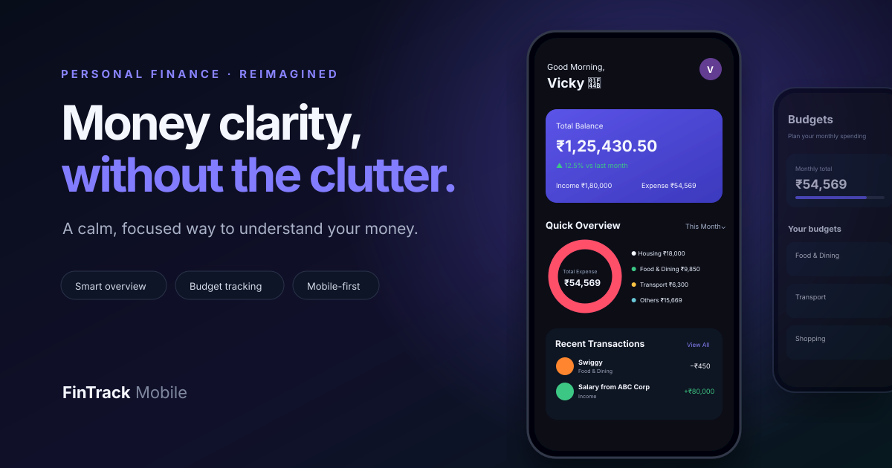

<div align="center">



<br />

# FinTrack Mobile

**A focused, mobile-first personal finance experience.**

[](https://vinay-712.github.io/FinTrack-Mobile/)
[](LICENSE)
[](https://github.com/vinay-712/FinTrack-Mobile/actions/workflows/quality.yml)

<br />

FinTrack turns everyday spending into a calm, useful picture of where your money goes.

[Case study](CASE_STUDY.md) · [Changelog](CHANGELOG.md) · [Contributing](CONTRIBUTING.md) · [Code of conduct](CODE_OF_CONDUCT.md) · [Security](SECURITY.md)

</div>

---

## The product

Managing money should create confidence—not more noise. FinTrack Mobile brings balances, spending patterns, budgets, and recent transactions together in a clean dark-mode interface designed for quick daily check-ins.

The product balances information density with calm visual hierarchy: the most important number leads, supporting context stays close, and every screen has a clear next action.

<table>
<tr>
<td width="33%"><strong>💳 See the full picture</strong><br /><sub>Balance, income, expenses, and monthly movement in one focused view.</sub></td>
<td width="33%"><strong>📊 Understand spending</strong><br /><sub>Category-level insights that remain useful without becoming overwhelming.</sub></td>
<td width="33%"><strong>🎯 Stay intentional</strong><br /><sub>Budgets, goals, recurring payments, and account tools in one system.</sub></td>
</tr>
</table>

## Experience at a glance

| Area | What it helps users do |
|---|---|
| **Dashboard** | Understand current financial health in seconds |
| **Transactions** | Review income and spending with clear category context |
| **Budgets** | Track monthly limits and spot categories needing attention |
| **Finance Hub** | Access goals, reports, accounts, categories, and recurring payments |
| **Profile & Settings** | Manage preferences and account-level controls |
| **Add Transaction** | Record income or expenses with minimal friction |

## Design principles

### 1. Lead with clarity

The total balance anchors the experience. Income, expenses, and trend context support it without competing for attention.

### 2. Make data approachable

Simple visual summaries and human-readable categories replace dense dashboards. Color is used intentionally for status and grouping—not decoration.

### 3. Keep common actions close

Recent activity, navigation, and the add-transaction action remain reachable from the primary dashboard.

### 4. Design for real mobile use

The 390 × 844 layout uses comfortable touch targets, compact information groupings, and predictable bottom navigation.

## Visual system

| Foundation | Direction |
|---|---|
| **Canvas** | Deep navy surfaces reduce glare and create focus |
| **Brand** | Indigo communicates intelligence, trust, and momentum |
| **Status** | Green highlights positive movement; warm accents distinguish spending groups |
| **Typography** | Inter keeps financial data precise and highly legible |
| **Shape** | Rounded cards soften dense information and establish clear groupings |
| **Spacing** | A consistent rhythm keeps the interface calm and scannable |

### Core palette

```text
App surface       #070D19
Card surface      #0E1421
Brand primary     #635CF7
Text primary      #F5F7FF
Text secondary    #9EA8BF
Positive / income #3DC785
Expense accent    #FF4F68
```

## Interactive prototype

<div align="center">

### [▶ Launch the FinTrack Mobile prototype](https://vinay-712.github.io/FinTrack-Mobile/)

Use the bottom navigation to explore **Home, Transactions, Budgets, and Profile**. Tap the center **+** button to open the working add-transaction flow.

</div>

This repository includes a responsive, dependency-free multi-screen interpretation of the FinTrack experience.

- On **desktop**, it appears as a polished product presentation with a framed mobile preview.
- On **mobile**, it becomes a full-screen app experience.
- Home, Transactions, Budgets, and Profile are fully navigable inside the device preview.
- The add-transaction action opens an interactive bottom sheet with save confirmation.
- No framework, installation, or build step is required.

### Run locally

```bash
git clone https://github.com/vinay-712/FinTrack-Mobile.git
cd FinTrack-Mobile
```

Run the repository checks:

```bash
npm run check
```

Then open `index.html` in your browser.

## Repository structure

```text
FinTrack-Mobile/
├── assets/
│   └── fintrack-hero.svg   # Branded project artwork
├── scripts/
│   └── check.mjs           # Dependency-free project validation
├── app.js                  # Prototype data and interactions
├── styles.css              # Responsive visual system
├── index.html              # Semantic prototype shell
├── CASE_STUDY.md           # UX process and product decisions
├── CHANGELOG.md            # Version history
├── README.md               # Product presentation
├── CONTRIBUTING.md         # Contribution workflow
├── CODE_OF_CONDUCT.md      # Community standards
├── SECURITY.md             # Responsible reporting policy
└── LICENSE                 # MIT license
```

## Screen inventory

The complete Figma flow contains:

`Dashboard` · `Transactions` · `Budgets` · `Profile` · `Add Transaction` · `Finance Hub` · `Reports` · `Accounts` · `Categories` · `Goals` · `Recurring` · `Settings`

## Roadmap

- [x] Core mobile visual system
- [x] Dashboard experience
- [x] Responsive web showcase
- [x] Interactive multi-screen prototype
- [x] Automated GitHub Pages deployment
- [x] Complete multi-screen product flow in Figma
- [ ] Interactive transaction filtering and search
- [ ] Budget creation and threshold alerts
- [ ] Category and recurring-payment management
- [ ] Local persistence and editable demo data
- [ ] Accessible chart descriptions and keyboard flows
- [ ] Production application architecture

## Contributing

Thoughtful contributions are welcome. Please read [CONTRIBUTING.md](CONTRIBUTING.md) before opening a pull request.

If you find a bug or have a product idea, [open an issue](https://github.com/vinay-712/FinTrack-Mobile/issues) with clear context and, where relevant, screenshots.

## License

FinTrack Mobile is available under the [MIT License](LICENSE).

---

<div align="center">

**Designed for clearer financial decisions.**

<sub>FinTrack Mobile · Product design and responsive prototype</sub>

</div>
